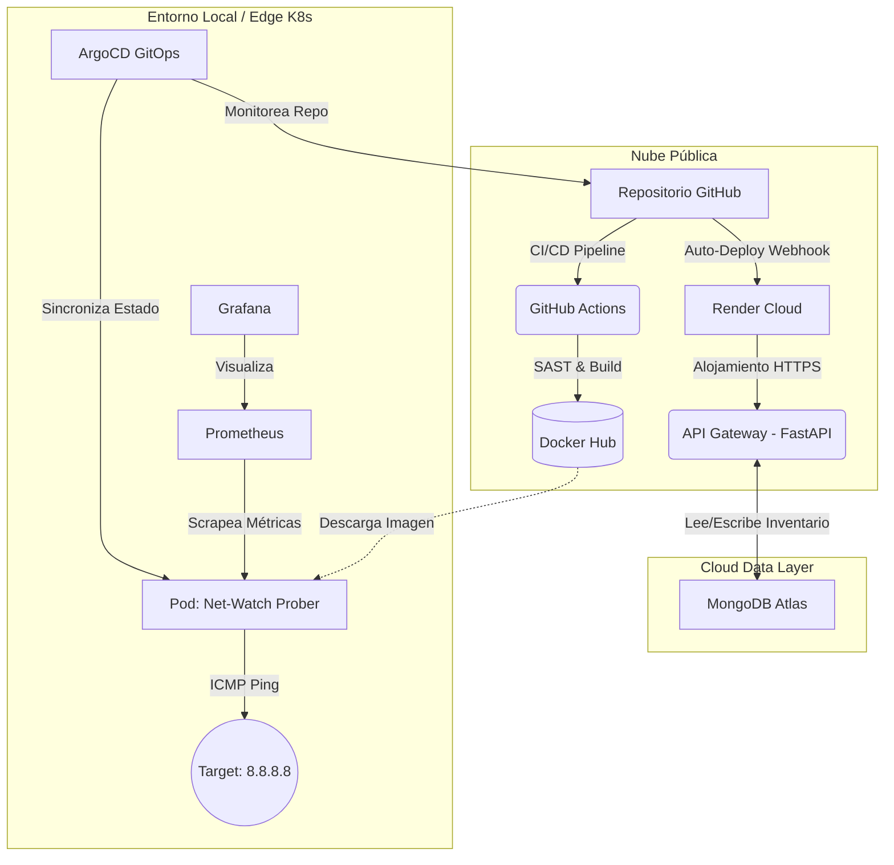
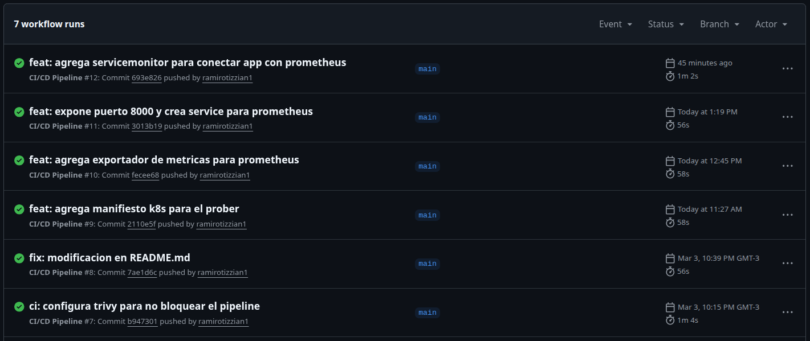
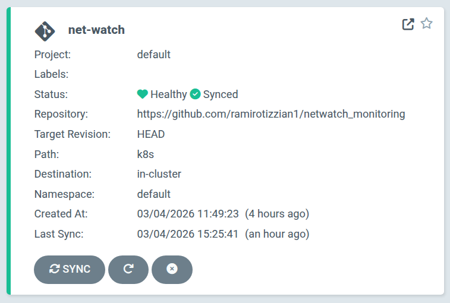
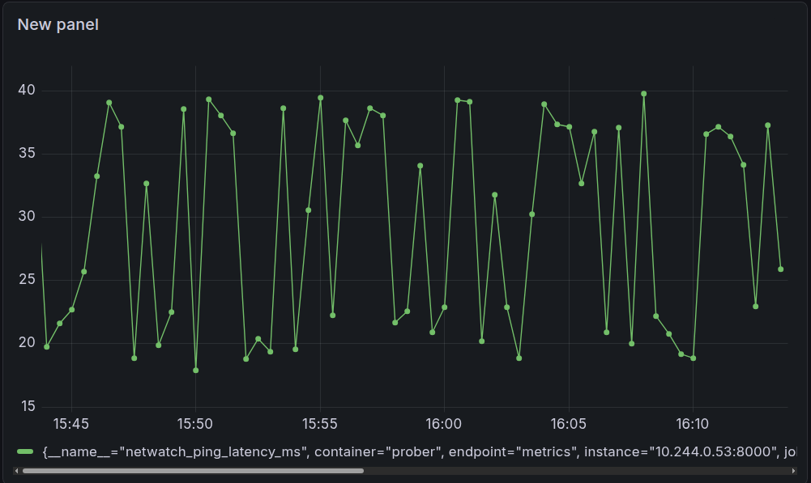
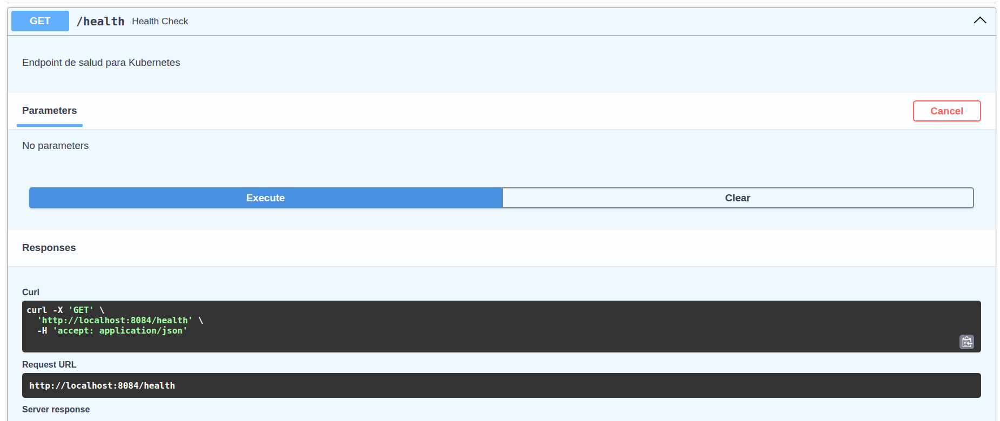
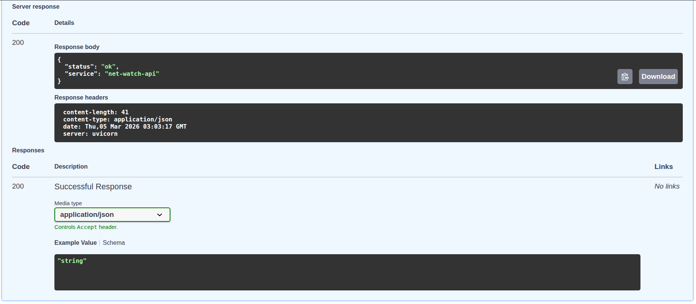
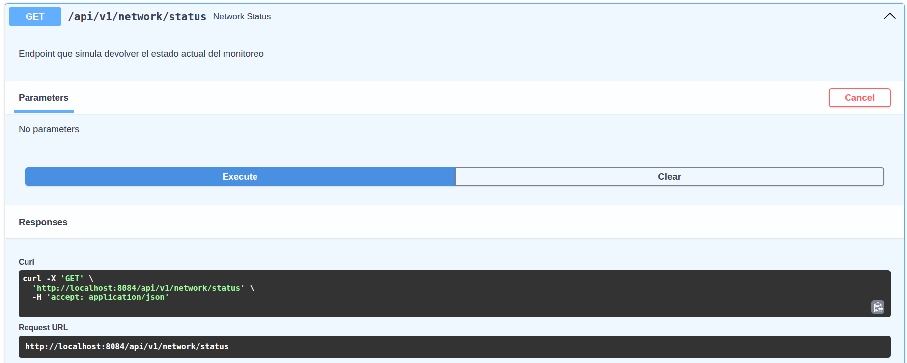

# Net-Watch: Plataforma de Observabilidad de Red (GitOps & CI/CD)

Sistema automatizado de monitoreo de disponibilidad y latencia de red, diseñado con arquitectura Cloud-Native, prácticas DevSecOps y GitOps.

## 🚀 Arquitectura y Tecnologías
* **Prober Service:** Microservicio en Python que ejecuta pruebas ICMP (Ping) y expone métricas en formato Prometheus.
* **Contenedores:** Dockerizado sobre imágenes ligeras (`python:3.10-slim`).
* **CI/CD (DevSecOps):** GitHub Actions con pruebas automatizadas y escaneo estático de vulnerabilidades (`Trivy` y `Bandit`).
* **Base de Datos (DBaaS):** MongoDB Atlas (NoSQL) integrada en la nube para gestionar el inventario de nodos de red (ej. equipos Cisco, MikroTik, servidores).
* **Orquestación:** Kubernetes (Minikube).
* **GitOps:** ArgoCD para la sincronización continua de manifiestos.
* **Observabilidad:** Kube-Prometheus-Stack (Prometheus + Grafana).
**API Gateway (NUEVO):** Microservicio REST desarrollado con FastAPI que actúa como punto de entrada para consultar el estado del monitoreo.
* **Contenedores:** Dockerizados de forma independiente sobre imágenes ligeras (`python:3.10-slim`).

---

## Despliegue

## 🏛️ Arquitectura del Sistema

El sistema utiliza una **Arquitectura Híbrida** dividida en dos planos:

1. **Plano de Ejecución y Monitoreo (Local/Edge - Kubernetes):**
   * **Prober Service:** Microservicio en Python/Docker que ejecuta mediciones de latencia ICMP.
   * **Prometheus & Grafana:** Stack de observabilidad desplegado vía Helm para la ingesta y visualización de métricas en tiempo real (`netwatch_ping_latency_ms`).
   * **ArgoCD:** Controlador GitOps que asegura que el estado del clúster coincida con la rama `main` del repositorio.

2. **Plano de Interfaz (Cloud Público):**
   * **API Gateway:** Microservicio REST (FastAPI) alojado en la nube pública (Render/Cloud Run). Expone el estado de la red y el estado de salud del sistema mediante endpoints HTTPS y documentación interactiva (Swagger UI).

## 🚀 Guía de Despliegue (Disaster Recovery)

Gracias al enfoque GitOps, reconstruir el clúster local desde cero toma menos de 5 minutos:

1. **Iniciar infraestructura base:**
   `minikube start`
2. **Instalar el operador GitOps (ArgoCD):**
   `kubectl create namespace argocd`
   `kubectl apply -n argocd -f https://raw.githubusercontent.com/argoproj/argo-cd/stable/manifests/install.yaml`
3. **Sincronizar el clúster:**
   Configurar la aplicación en ArgoCD apuntando a la carpeta `/k8s` de este repositorio. El operador desplegará automáticamente los Deployments, Services y ServiceMonitors.
4. **Desplegar Stack de Monitoreo (Helm):**
   `helm repo add prometheus-community https://prometheus-community.github.io/helm-charts`
   `helm install monitoreo prometheus-community/kube-prometheus-stack -n monitoring --create-namespace`

## 📊 Diagramas de Arquitectura

### 1. Pipeline CI/CD (GitHub Actions)
El flujo automatizado compila, escanea y publica la imagen en Docker Hub ante cada commit en la rama `main`.

### 2. Despliegue GitOps (ArgoCD)
ArgoCD monitorea este repositorio y despliega automáticamente los recursos en Kubernetes (`Deployment`, `Service`, `ServiceMonitor`).

### 3. Observabilidad (Grafana)
Las métricas generadas por el Prober (`netwatch_ping_latency_ms`) son recolectadas por Prometheus y visualizadas en tiempo real en Grafana.

### 4. API REST (Swagger UI)
El microservicio de la API expone los endpoints de consulta de estado (`/api/v1/network/status`) y salud (`/health`), autogenerando su documentación interactiva mediante Swagger.

---

## 🛠️ Estructura del Proyecto
- `/src/prober/`: Código fuente y Dockerfile del agente medidor de latencia.
- `/src/api/`: Código fuente y Dockerfile de la API REST Gateway.
- `/k8s/`: Manifiestos de Kubernetes (Deployments, Services, ServiceMonitor).
- `/.github/workflows/`: Definición del pipeline de Integración Continua multi-imagen.